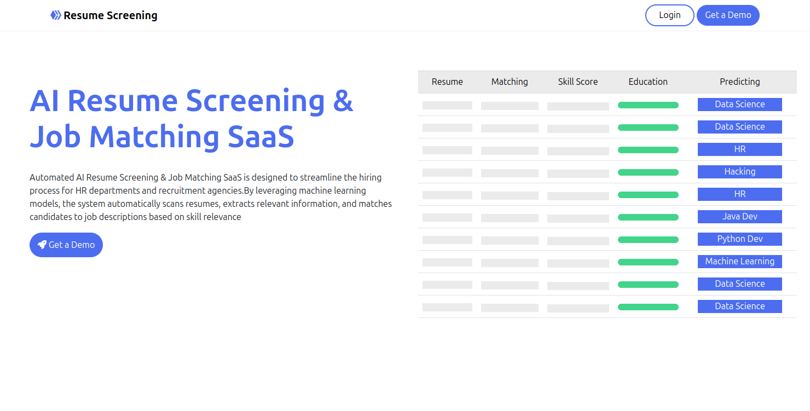

# Automated AI Resume Screening

Automated AI Resume Screening is a web application that allows users to upload resumes and job descriptions in PDF format. The system processes these documents using AI and NLP techniques to extract skills, education, experience, and match resumes with job descriptions based on similarity scores.




## Features
- Upload resumes and job descriptions (PDF format)
- Extract and analyze skills, education, and experience
- Predict the most relevant job category for a resume
- Compute resume-job matching scores based on skills and similarity
- Store and retrieve screening results from the database
- Built using FastAPI (backend) and React TypeScript (frontend)

## Technologies Used
### Backend:
- FastAPI (Python)
- SQLAlchemy (Database ORM)
- PostgreSQL (Database)
- PyPDF2 (PDF processing)
- Flair (Named Entity Recognition for extracting names)
- Sentence Transformers (Semantic text similarity)
- Scikit-learn (Machine learning models)

### Frontend:
- React.js (TypeScript)
- Bootstrap & Chart.js (Visualization)

## Installation & Setup

### Backend Setup
1. Clone the repository:
   ```bash
   git clone https://github.com/alihassanml/Automated-AI-Resume-Screening.git
   cd Automated-AI-Resume-Screening/backend
   ```
2. Create a virtual environment:
   ```bash
   python -m venv venv
   source venv/bin/activate  # On Windows use: venv\Scripts\activate
   ```
3. Install dependencies:
   ```bash
   pip install -r requirements.txt
   ```
4. Run the FastAPI server:
   ```bash
   uvicorn main:app --reload
   ```

### Frontend Setup
1. Navigate to the frontend directory:
   ```bash
   cd ../frontend
   ```
2. Install dependencies:
   ```bash
   npm install
   ```
3. Start the React development server:
   ```bash
   npm run dev
   ```

## API Endpoints
### Upload Resume & Job Description
- **Endpoint:** `POST /upload`
- **Description:** Uploads a resume and job description for processing
- **Request Body:** Multipart form with `resume` and `job` files (PDF)
- **Response:** JSON containing processing results and database entry ID

### Get Resume Screening Result
- **Endpoint:** `GET /results/{id}`
- **Description:** Fetches the screening result for a given ID
- **Response:** JSON containing extracted details, matching scores, and resume ranking

## How It Works
1. User uploads a resume and job description
2. System extracts skills, education, experience using NLP
3. Computes skill and text similarity scores
4. Predicts the job category for the resume
5. Stores the results in a database
6. User retrieves the results via the API or frontend

## Future Enhancements
- Improve job matching using deep learning models (e.g., BERT)
- Support for additional file formats (e.g., DOCX)
- Expand the frontend UI for better visualization
- Integration with job portals for automated screening

## License
This project is licensed under the MIT License.

## Contact
For any queries, reach out to [Ali Hassan](https://github.com/alihassanml).

